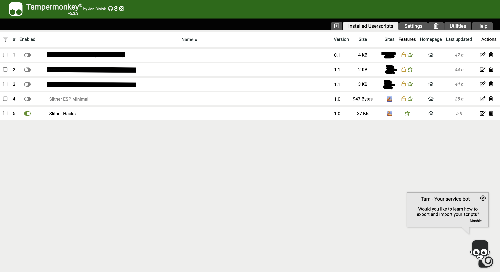

# Slither Bot

A powerful and feature-rich bot for Slither.io, providing enhanced gameplay with visual overlays and intelligent food targeting.

## Features

### Visual Overlays
- Real-time enemy tracking with distance-based color coding
- Food targeting visualization
- Mouse position tracking
- Bot target position visualization
- Status display showing:
  - Bot state (ON/OFF)
  - Current coordinates
  - Enemy count and positions
  - Danger level

### Intelligent Food Targeting
- Smart food selection based on:
  - Distance to food
  - Food size
  - Local food density
  - Enemy proximity
- Dynamic targeting system that adapts to different situations:
  - Safe mode when no enemies are nearby
  - Evasive maneuvers when enemies are close
  - Strategic food collection based on enemy positions

### Safety Features
- Automatic enemy avoidance
- Distance-based threat assessment
- Blacklist system for unreachable food
- Three-tier enemy distance classification:
  - Close range (<300 units)
  - Mid range (300-700 units)
  - Long range (>700 units)

## Installation

1. Install a userscript manager browser extension (like Tampermonkey or Greasemonkey)
2. Create a new script
3. Copy and paste the contents of `slither_bot.js` into the script editor
4. Save the script

## Usage

1. Navigate to [Slither.io](http://slither.io)
2. The bot will automatically start when you enter the game
3. Press `T` to toggle the bot ON/OFF
4. Watch the visual overlays to understand the bot's behavior

## Controls

- `T`: Toggle bot ON/OFF
- Mouse movement: Manual control when bot is OFF

## Visual Indicators

- **Red Lines**: Close enemies (high threat)
- **Yellow Lines**: Mid-range enemies (medium threat)
- **Green Lines**: Distant enemies (low threat)
- **Cyan Lines**: Food targets
- **Magenta Line**: Real mouse position
- **Yellow Line**: Bot target position

## Technical Details

The bot uses several sophisticated algorithms to:
- Calculate optimal paths to food
- Assess enemy threats
- Determine safe zones
- Manage food targeting priorities

## Disclaimer

This bot is for educational purposes only. Please check Slither.io's terms of service regarding the use of bots and automation tools.

## Author

Created by EliottValette

## Version

Current version: 1.0
